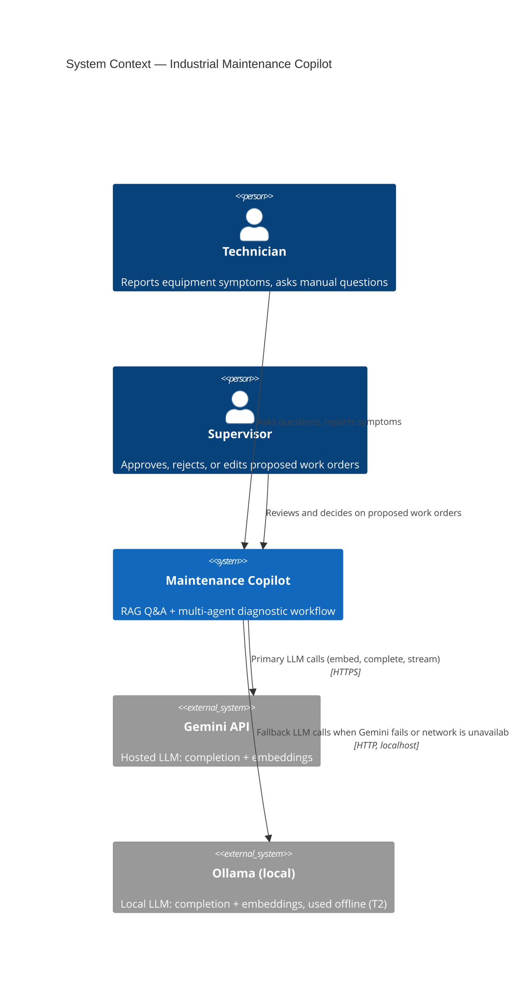
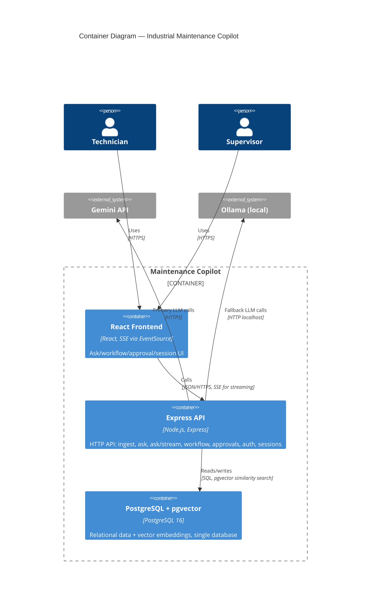
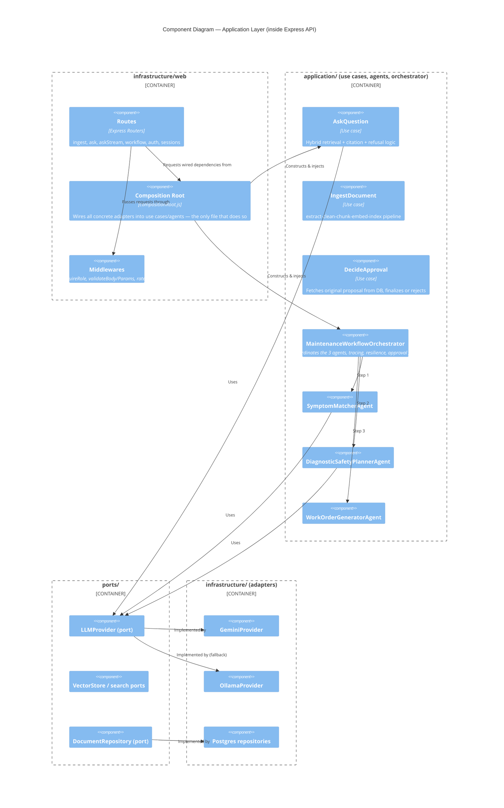
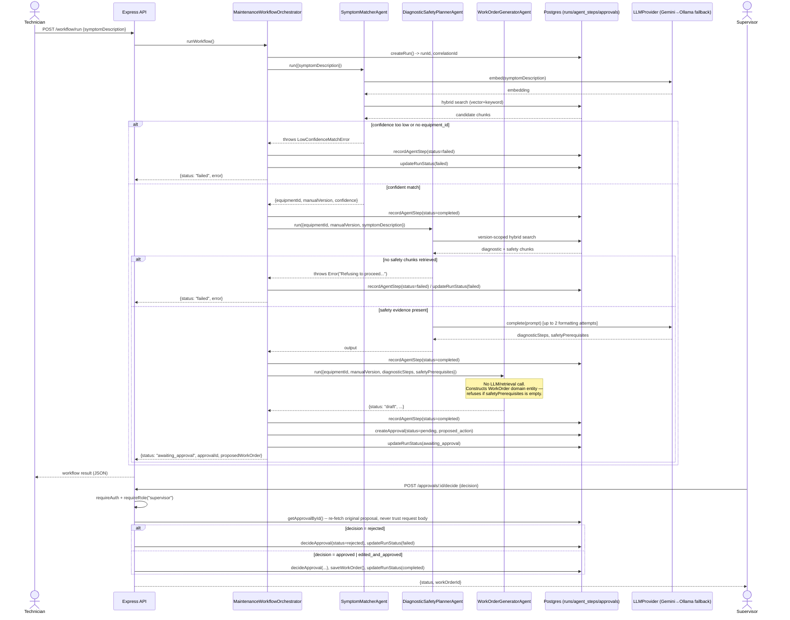
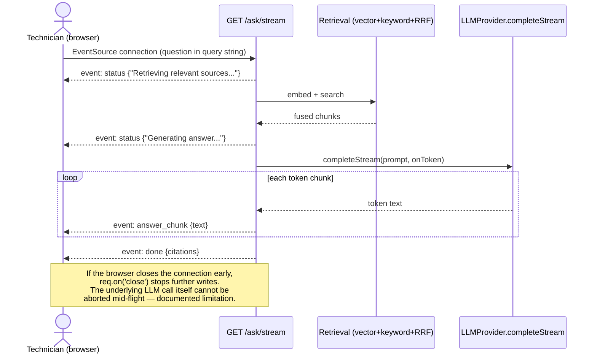
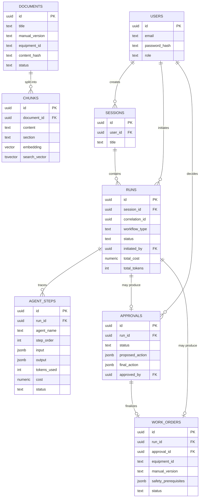

# Architecture Document
## Industrial Field Maintenance Copilot (D5 + T2)

All diagrams below are written in Mermaid syntax and are committed as
source in this file (not only as rendered images), per the project
requirement. They render automatically on GitHub and in most Markdown
viewers.

---

## 1. C4 Model — Level 1: System Context

---

## 2. C4 Model — Level 2: Containers

---

## 3. C4 Model — Level 3: Components (Application Layer)

---

## 4. Sequence Diagram — Full Agentic Workflow (Symptom → Approval → Work Order)

---

## 5. Sequence Diagram — SSE Streaming (`/ask/stream`)

---

## 6. Data-Flow Diagram — Trust Boundaries

```mermaid
flowchart TB
    subgraph Untrusted["Untrusted input"]
        U1[Technician question/symptom text]
        U2[Ingested document content]
    end

    subgraph Trusted["Trusted / system-controlled"]
        T1[System prompt rules in buildPrompt.js]
        T2[Zod schema validation]
        T3[Server-derived JWT claims: userId, role]
    end

    subgraph Boundary["TRUST BOUNDARY: what the LLM provider sees"]
        P1[Full prompt sent to Gemini/Ollama:<br/>trusted rules + untrusted retrieved chunks + user question]
    end

    subgraph External["External services"]
        E1[Gemini API]
        E2[Ollama - local, no external network]
    end

    U1 -->|validated via Zod middleware| T2
    U2 -->|ingested, chunked, embedded, stored| DB[(Postgres)]
    DB -->|retrieved chunks - still untrusted content| P1
    T1 --> P1
    T2 --> P1
    U1 -->|question text| P1
    P1 -->|HTTPS, leaves the system boundary| E1
    P1 -->|localhost only, never leaves the machine| E2
    T3 -.->|never included in LLM prompt| P1

    style Untrusted fill:#3a1f1f
    style Boundary fill:#3a2f1f
    style External fill:#1f2a3a
```

**Key point:** retrieved document content is explicitly labeled as
untrusted even after ingestion — a document can contain an embedded
instruction (as CP-310's sample manual deliberately does for testing),
and `buildPrompt.js` structurally separates trusted system rules from
this untrusted content so the LLM is instructed to treat it as data,
never as commands. JWT claims and other authorization state are never
sent to the LLM provider.

---

## 7. Entity-Relationship Diagram

---

## 8. Layer Dependency Diagram (Hexagonal Architecture)

```mermaid
flowchart TB
    subgraph Domain["domain/ — zero external imports"]
        D1[WorkOrder entity]
        D2[Domain errors]
    end

    subgraph Application["application/ — imports domain/ and ports/ only"]
        A1[Use cases]
        A2[Agents]
        A3[Orchestrator]
        A4[Zod contracts]
    end

    subgraph Ports["ports/ — interfaces only, no implementation"]
        P1[LLMProvider]
        P2[DocumentRepository]
    end

    subgraph Infrastructure["infrastructure/ — the only layer allowed external SDKs"]
        I1[GeminiProvider / OllamaProvider]
        I2[Postgres repositories]
        I3[Express routes/middleware]
    end

    subgraph Config["config/ — composition root"]
        C1[providerConfig.js]
        C2[compositionRoot.js]
    end

    Application --> Domain
    Application --> Ports
    Infrastructure -.implements.-> Ports
    Config --> Ports
    Config --> Infrastructure
    Config --> Application
    Infrastructure -.never imports.-> Application
    Infrastructure -.never imports.-> Domain

    style Domain fill:#1f3a2a
    style Application fill:#1f2f3a
    style Ports fill:#3a3a1f
    style Infrastructure fill:#3a1f2a
    style Config fill:#2a1f3a
```

**Acceptance test this diagram supports:** swapping `GeminiProvider` for
a different LLM vendor, or swapping Postgres for another database,
requires changes only inside `infrastructure/` plus configuration in
`config/` — zero changes to `application/` or `domain/`. This was
exercised in practice: adding Ollama as a second provider required no
changes to any agent or use case, only a new adapter and a
composition-root wiring change.

---

## 9. Architecture Decision Records

### ADR-001: Chunking Strategy — Format-Agnostic Section Boundaries

**Decision:** Split manual text into chunks by section boundary,
matching two observed header formats generically (`Section N: Title`
and `N. Title`) rather than a fixed list of section names or a
fixed-size token window.

**Why:** Fixed-size chunking risks splitting the Safety Prerequisites
section mid-way, which for D5's core risk (a skipped safety step) is
unacceptable — a truncated safety section could cause the system to
believe it has complete safety evidence when it does not. Matching by
heading shape rather than exact section names was necessary once
different source documents were found to use different header
conventions (discovered when several ingested documents silently
produced zero chunks under an earlier, stricter regex).

**Alternatives considered:**
- Fixed-size (e.g. 500-token) chunking with overlap — rejected due to
  the safety-truncation risk above.
- A fixed whitelist of exact section titles — rejected after
  discovering real documents in the sample corpus used inconsistent
  title wording (e.g. "Equipment Overview" vs "Operating Parameters"
  for a similar first section).

**Known limitation:** The heading-detection regex
(`[A-Z][A-Za-z ]{2,40}` for the numbered-title format) can misfire on
an unusually short, capitalized diagnostic step. Accepted as a
reasonable trade-off for MVP scope; documented here rather than hidden.

---

### ADR-002: Hybrid Retrieval Fusion — Reciprocal Rank Fusion + Mandatory/Optional Keyword Matching

**Decision:** Combine dense (pgvector cosine similarity) and keyword
(PostgreSQL full-text search) results using Reciprocal Rank Fusion
(RRF, k=60). For keyword search specifically, equipment/model
identifiers (matching an equipment-ID-like pattern) are required to
match (AND), while all other query terms match on an OR basis.

**Why RRF:** Cosine similarity and `ts_rank` are on different,
non-comparable scales; RRF avoids needing to normalize them by scoring
purely on rank position across both lists.

**Why mandatory/optional term splitting:** An initial implementation
using `websearch_to_tsquery` directly on the full natural-language
question returned zero keyword results in practice, because
requiring all question words to match (the default AND behavior) is
too strict for how technicians phrase questions. Switching to a pure
OR match fixed retrieval but weakened precision for equipment-specific
queries. The final design requires equipment identifiers (the most
information-dense token in a maintenance query) to match while
relaxing everything else — a deliberate precision/recall trade-off,
not a theoretically ideal solution.

**Alternatives considered:**
- Pure vector search only — rejected; the project brief explicitly
  requires hybrid retrieval.
- Learned re-ranking / cross-encoder — considered as the "one
  additional enhancement" required by FR-2, but metadata filtering
  (by manual version) was chosen instead because it solves a concrete,
  observed problem (cross-version content contamination) rather than a
  theoretical one.

---

### ADR-003: Vector Store — pgvector inside PostgreSQL (not a dedicated vector database)

**Decision:** Use PostgreSQL with the pgvector extension for both
relational and vector data, in a single database, rather than a
separate dedicated vector database (e.g. Pinecone, Qdrant, Weaviate).

**Why:** The system needs both classical relational data (users,
runs, approvals, work orders, with real foreign keys and transactional
integrity) and vector search. A single database avoids operating two
data stores, avoids any additional paid service (the project
explicitly requires no paid subscriptions), and runs entirely locally
via Docker Compose. An HNSW index (chosen over the initially-configured
IVFFlat index, which produced explicit low-recall warnings on a small
corpus) provides accuracy without a minimum data-volume requirement.

**Alternatives considered:**
- A dedicated vector database — rejected for added operational
  complexity and (in most cases) cost, for no retrieval-quality
  benefit at this corpus size.
- MongoDB with Atlas Vector Search — rejected because it would still
  require a paid tier for production-grade vector search and does not
  natively provide the same relational/transactional guarantees needed
  for `runs`/`approvals`/`work_orders`.

---

### ADR-004: T2 (Offline/Degraded Mode) — Provider Abstraction with Automatic Fallback

**Decision:** Implement a single `LLMProvider` port (covering
`complete`, `completeStream`, and `embed`) with two adapters —
`GeminiProvider` (hosted) and `OllamaProvider` (local) — and a
composition-root wrapper (`providerConfig.js`) that tries Gemini first
and automatically falls back to Ollama on any failure (network error,
rate limit, service unavailability), for every LLM call in the system.

**Why this design specifically:**
- A single interface means no agent, use case, or route needs to know
  which provider actually served a request — this was verified in
  practice by running the same code with the network disconnected and
  observing correct automatic fallback with zero code changes at the
  call sites.
- The local embedding model (`nomic-embed-text`) was deliberately
  chosen for its 768-dimension output specifically because it matches
  Gemini's configured embedding dimension — after discovering Gemini's
  `text-embedding-004` model had been deprecated in favor of
  `gemini-embedding-001` (which defaults to 3072 dimensions), the
  Gemini adapter explicitly requests `outputDimensionality: 768` so
  the `chunks.embedding VECTOR(768)` column works unmodified regardless
  of which provider serves a given request.

**Alternatives considered:**
- Manual mode-switching (a config flag the operator sets by hand) —
  rejected as the primary mechanism because T2 explicitly requires the
  system to "switch automatically on failure"; a manual override flag
  (`FORCE_OFFLINE_MODE`) was added in addition, for testing/demo
  purposes, but automatic fallback is the default behavior.
- A single "best-effort" provider with no fallback — rejected;
  directly contradicts the assigned twist.

**Documented capability gap (measured, not assumed):** Evaluation
runs showed a real, measured difference between an online/mixed run
(92% refusal correctness, 88% groundedness) and a fully offline run
with the network disconnected (52% refusal correctness, 50%
groundedness), attributable to both the smaller local embedding model
and the smaller local generation model (`llama3.2:3b`). This is
disclosed in full in `docs/EVALUATION.md` rather than glossed over —
per the project brief's explicit guidance that "capability differences
[must be] documented honestly."
